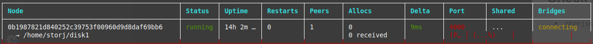

# Install Storj Share Daemon and Run It
[ [ Intro ] ](README.md) -- [ [Add User](user.md) ] -- [ [Create Partition](harddrive.md) ] -- [ [**Install & Run Daemon**](daemon.md) ] -- [ [Optimization](optimization.md) ] -- [ [Monitoring](monitor.md) ]

-----
## Install System Updates
- `$ sudo apt-get update && sudo apt-get update -y && sudo apt-get dist-upgrade`

## Install Necessary Utilities
- `$ sudo apt-get install git python build-essential -y`
## Install `storjshare` Daemon via `npm`
- `$ npm install --global storjshare-daemon`

## Check If Daemon Is Correctly Installed
- `$ storjshare -V`
```
daemon: 5.3.1, core: 8.7.2, protocol: 1.2.0
```

## Make a New Directory for Log Files
- `$ mkdir ~/storjshare-logs`

## Start the Daemon
- `$ storjshare daemon`

## Initiate a New Node
- create
```
$ storjshare create --storj <wallet_addr> --storage /home/storj/disk1 --size 930GB --rpcaddress <external_IP> --rpcport 4000 --maxtunnels 0 --tunnelportmin 0 --tunnelportmax 0 --logdir /home/storj/storjshare-logs/ --verbosity 3
```
| Flag        | Description           
| ------------- |-------------|
| --storj | ERC20 compatiable wallet address |
| --storage      | storage path; mounting point|
| --size | space allocation for the node     |
| --rpcaddress      | node's external IP |
| --rpcport      | node's port number      |
| --maxtunnels | max num. of tunnels the node offers      |
| --tunnelportmin      | initial port number assigned to tunnels |
| --tunnelportmax      | final port number assigned to tunnels |
| --logdir | log directory |
| --verbosity | log level |
A configuration file for the node will be generated under `/home/storj/.config/storjshare/configs`. 
- `$ ls /home/storj/.config/storjshare/configs`
```
<0bXXX>.json
```
Open the config file and set `"doNotTraverseNat"` to `true`.

- `$ nano /home/storj/.config/storjshare/configs/<0bXXX>.json`
```
"doNotTraverseNat": true,
```

## Start the Node
- `$ storjshare start --config /home/storj/.config/storjshare/configs/<0bXXX>.json`

## Check Node's Status
- `storjshare status`


---
Next: [Optimization](optimization.md)